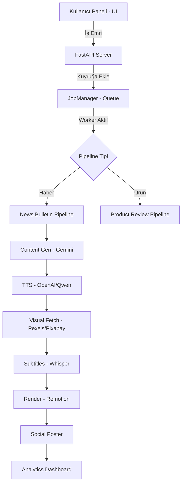
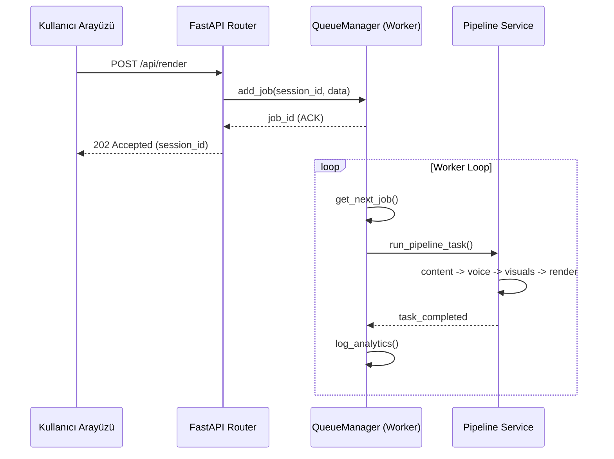

# 🏗 YTRobot Teknik Mimari Şeması

YTRobot, yüksek performanslı ve asenkron bir "İçerik Fabrikası" olarak tasarlanmıştır. Bu döküman, sistemin modüler bileşenlerini ve veri akışını anlatır.

## 1. Genel Sistem Mimarisi

Sistem; FastAPI tabanlı bir backend, Remotion tabanlı bir render motoru ve AI (Gemini/Whisper) servislerinden oluşur.

## 2. Asenkron İş Kuyruğu (JobManager)

İşler (Jobs), sunucuyu bloklamadan asenkron olarak işlenir. 

## 3. Akıllı B-Roll (AI) Karar Mekanizması

Görsel materyal eksik olduğunda sistem otonom olarak devreye girer.

1.  **Analiz**: Gemini AI, sahne metnini analiz eder.
2.  **Keyword**: Sahneye en uygun 3 anahtar kelimeyi (İngilizce) üretir.
3.  **Search**: Pexels ve Pixabay API'lerinde arama yapar.
4.  **Selection**: Çözünürlüğü ve süresi en uygun olan medyayı indirir.

## 4. Veri Saklama Katmanı
- **Sessions**: Her üretim `/sessions/{sid}` klasöründe izole edilir.
- **Analytics**: Genel istatistikler `stats.json` dosyasında tutulur.
- **Cache**: İndirilen görseller `src/core/cache.py` üzerinden optimize edilir.
